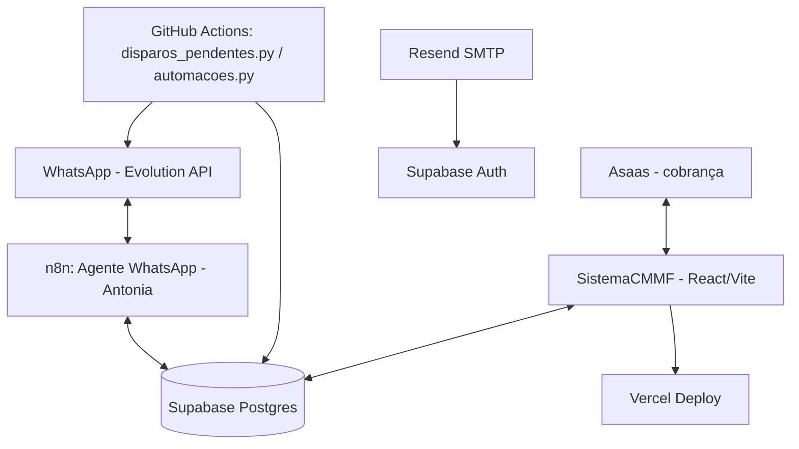

# Arquitetura

## Componentes

## Peças principais

- **Antonia** — chatbot WhatsApp. Fluxo: Evolution API (WhatsApp) → webhook n8n (`Agente WhatsApp - Centro de Música`, id `gOwD7CVrfFShDyRDZ8y9H`) → consulta/grava direto no Supabase (sem Google Sheets, migrado em 01-02/09) → responde via Evolution API.
- **SistemaCMMF** — CRM em React/TypeScript/Vite/Tailwind, hospedado na Vercel, fala direto com Supabase (anon key no client, service role só em `api/*.js` serverless functions).
- **Motor de disparos programados** — GitHub Actions (`scripts/disparos_pendentes.py`, `scripts/automacoes.py`), cron a cada 15min. Decisão de 24/08: **não usar mais n8n para isso** (custo de execuções). O workflow n8n equivalente (`Disparos Pendentes - CMMF`) foi desativado.
- **Banco** — Supabase Postgres, migrations manuais numeradas em `agenteCMMF1/supabase/migration-vNN-*.sql`, aplicadas via `psql` direto (ver [DATABASE.md](./DATABASE.md)).
- **Cobrança/mensalidades** — Asaas (gateway), integrado via `SistemaCMMF/api/asaas-*.js` (Vercel serverless) e `SistemaCMMF/supabase/functions/asaas-*` (edge functions).
- **E-mails de acesso (convite, recuperação de senha)** — Supabase Auth com SMTP customizado (Resend), templates em PT-BR (ver histórico em [CHANGELOG.md](./CHANGELOG.md)).

## Workflows n8n (auditoria 04/09)

| ID | Nome | Ativo | Observação |
|---|---|---|---|
| `gOwD7CVrfFShDyRDZ8y9H` | Agente WhatsApp - Centro de Música (Antonia) | ✅ | principal, em uso |
| `tee5yBJNi0C9O1oy` | Google Forms - Avaliação Satisfação | ✅ | webhook `/webhook/google-forms-satisfacao` |
| `vyzyYkdubZ5Gar1w` | Consultar Disponibilidade - Google Sheets | ✅ | **verificar se ainda é usado** — a lógica de disponibilidade foi migrada pra dentro do próprio fluxo da Antonia (consulta direta Supabase), este workflow separado pode estar redundante/órfão |
| `7qB2ALgyQdqoMpm3` | Automações Agendadas - CMMF | ❌ | inativo — checar se faltas/reposições/lembretes ainda dependem dele ou se tudo já foi pro GitHub Actions |
| `EubhH5q3WflY5ZMQ` | Disparos Pendentes - CMMF | ❌ | inativo de propósito (substituído por GitHub Actions, decisão 24/08) |
| `eBDLegYaGpean1ku` | Webhook Pagamento - CMMF | ❌ | inativo — confirmar se Mercado Pago/Asaas ainda usam isso ou se é candidato a exclusão |
| `tgtP0rP4japW9Cqp` | Captura de Leads - WhatsApp | ❌ | inativo — confirmar se é código morto |

**Ação recomendada:** revisar os 4 workflows marcados acima com o time antes de excluir — podem estar só pausados temporariamente ou já obsoletos. Nenhum foi apagado, só documentado o estado atual.
